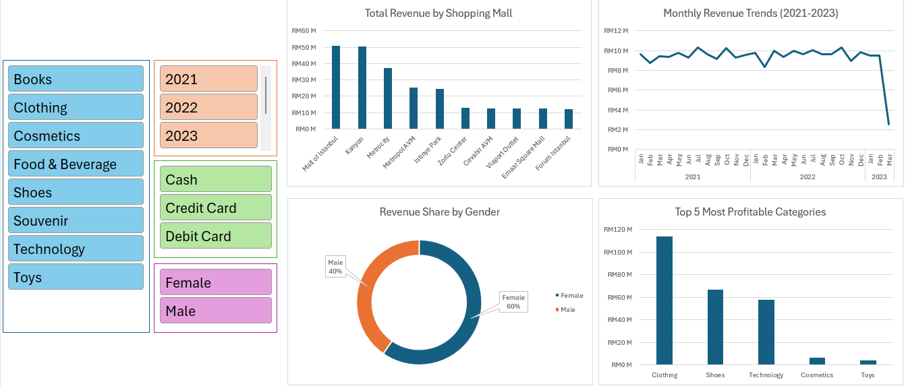

# Istanbul E-Commerce Sales Analysis (Excel)

## Project Overview
This project analyzes a **10,000+ row e-commerce dataset** to uncover purchasing patterns, revenue trends, and location-based performance.  
The final deliverable is an **interactive Excel dashboard** that allows stakeholders to filter sales metrics by multiple business dimensions.

## Tools Used
- Microsoft Excel
- Power Query
- Pivot Tables
- Pivot Charts
- Data Validation
- Custom Formatting

## Key Features

### Interactive Sales Dashboard
- Dynamic dashboard with slicers for **Year, Product Category, and Payment Method**
- Enables quick filtering and exploration of sales performance

### Data Cleaning & Transformation
- Standardized date formats using **Text to Columns**
- Corrected inconsistent data types
- Created calculated columns for **Total Revenue**

### Business Insights Visualized
- **36-month revenue trend analysis**
- **Top 5 most profitable product categories**
- **Revenue distribution across 10 shopping malls**
- **Revenue share by gender**

### Dashboard Preview

## Dataset Source
Kaggle Istanbul E-Commerce Dataset
